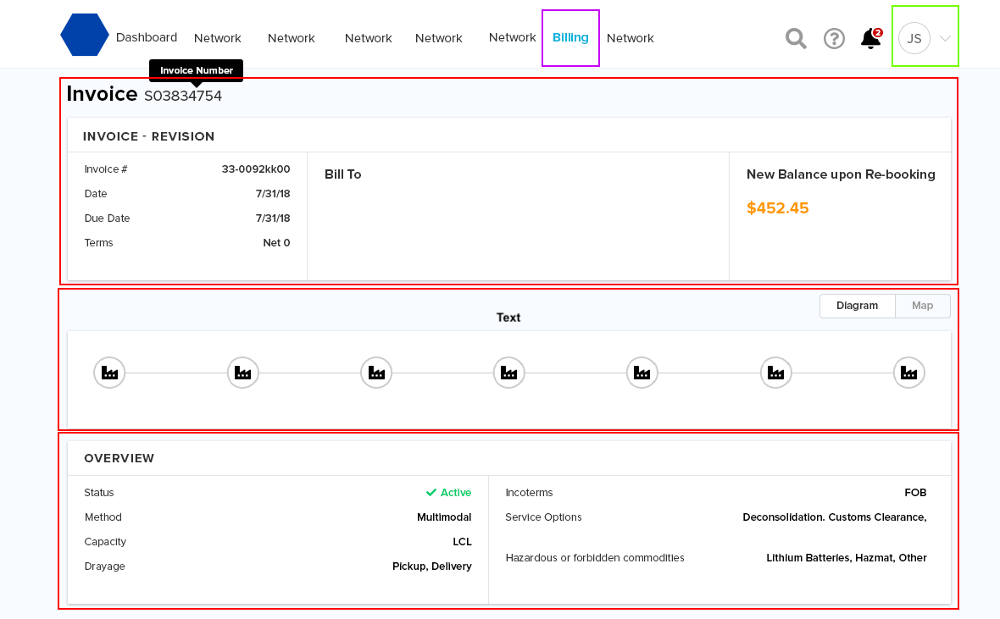
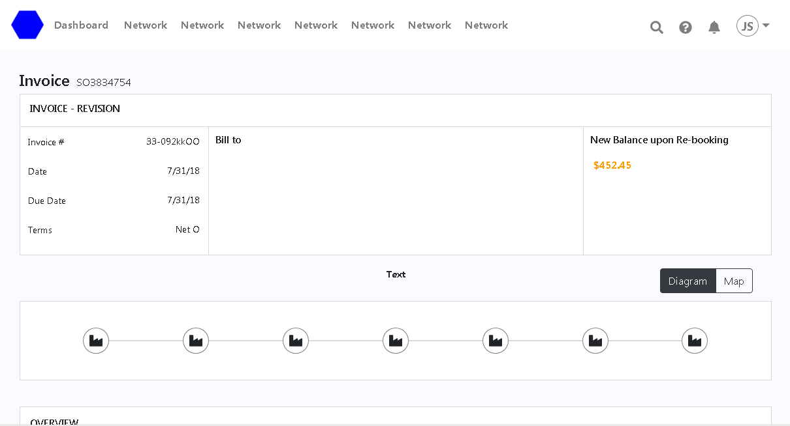

# REACT DASHBOARD

> Run your client with a single command

## Quick Start

``` bash
# Install dependencies for client
yarn install

# Run your app
yarn start

# Client on http://localhost:3000
```

## Folder Distribution

The workflow I currently use is as follows:

- public
    - index.html 
- src
    - Assets
        - css
            - invoice
            - navbar
            - overview
        - images
    - Components
        - Direction.js
        - Invoice.js
        - Navbar.js
        - Overview.js
    - App.css
    - App.js
    - Index.js

## What is this app about

We're taking on a Challenge to create the following design:



And the end result is the following:



Which was made with Styled-Components and Reactstrap.

## What each component does

The work started with the Navbar which was alredy given to us by Reactstrap, I installed "react-icons" to use "fontawesome" icons and use Bootstrap to organize the Navbar the way it was designed.

Then it was time for the Invoice section, where a combination of Flexbox, CSS Grid and HTML5 was used to create the layout.

It was time for the Direction section, using CSS Grid it was easy to setup and using React states to toggle between two components to finish the section.

Finally the Overview section, very similar to invoice section and was done quick.

## Closure

This app shows the Frontend of a static design which was a challenge given, from what I learned was to use Reacstrap which is in my opinion a downgrade of Bootstrap 4 where some key components were missing which could've made things easier on the css part, but overall its a challenge that was requested to do with bootstrap but it could've been done without it and the functionality would be the same.

Since it was done within a time limit, there are some aspects that needs to be corrected, like the mix of using plain css and styled-components, its prefered to use one or the other to avoid the mix of different ways of styling. 

Very important is the consideration on responsiveness, due to time constraint I wasn't able to work on that more, but overall everything tasked was donde.

**Made by Adrian Beria.**

**Web Developer.**